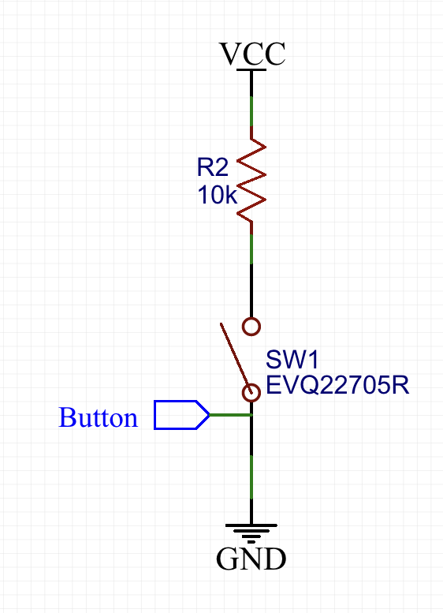
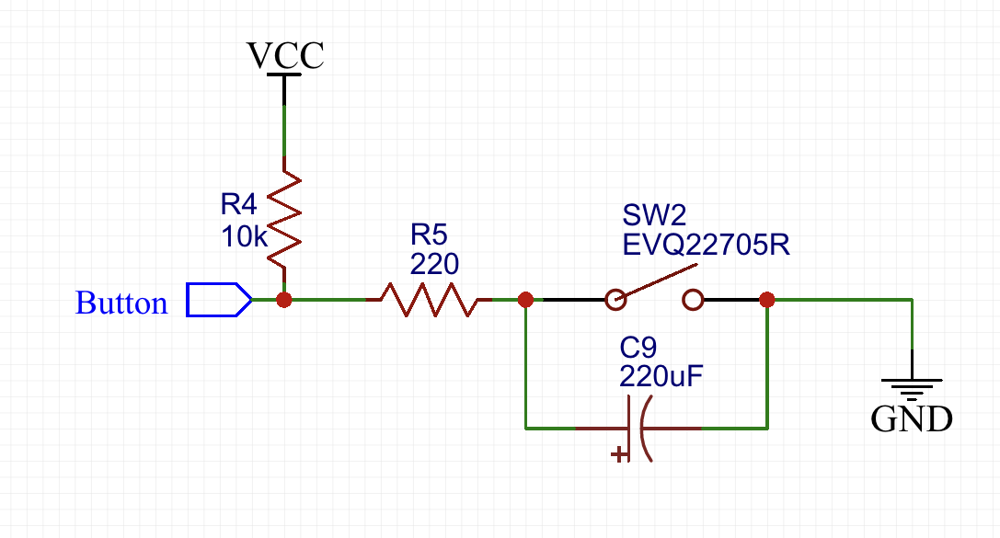

# scankey

## Disclaimer

- Just a note relative to my recent works. 
- Use at your own risk.

## Scan Key Event for STM32 projects
> Develope on a the top of a famous key-scan sample online

- "trg" flag is raised on single press.
- Single click event triggered on **release**.
- Long press event triggered on **timeout**, and will not have a single click event first within the debouncing time.
- Software debouncing is not included
- Support both PULLDOWN and PULLUP buttons
    > pre-defined in header file
- 2 callbacks for both events

## Usage

### Set parameters in header file (key.h)

1. Set LONG_PRESS_INTERVAL in ms.
2. Set DEBOUNCING in ms.
3. #define ACTIVE HIGH if the button is with pull up resistor or leave it.
4. Set KEY with different PIN number or other readpin method.

~~~ c

#define KEY HAL_GPIO_ReadPin(GPIOA, BTN_Pin)

~~~

### Setup

1. ImplAement onClick() & onLongPress() in your main.c
2. Place KeyScan() in main loop to do polling check.

#### RTOS version

~~~ c
//freertos.c
// inside task loop
  for(;;){
    keyScan();
    osDelay(DEBOUNCING);
  }
~~~

#### Polling version

~~~ c
//main.c
// inside main loop
  for(;;){
    while( getSysTick() % DEBOUNCING == 0 ){
      keyScan();
    }
  }
~~~

### Design reference

### 1. Upper Edge trigger

- From Low to High

### 2. Lower Edge trigger

- From High to Low with hardware debouncing

## ToDo

- Distinguish multiple keys
- Replace osDelay() with other method to achieve better decoupling.

# Released under MIT License

Copyright (c) 2019 YaoYu Li.

Permission is hereby granted, free of charge, to any person obtaining a copy of this software and associated documentation files (the "Software"), to deal in the Software without restriction, including without limitation the rights to use, copy, modify, merge, publish, distribute, sublicense, and/or sell copies of the Software, and to permit persons to whom the Software is furnished to do so, subject to the following conditions:

The above copyright notice and this permission notice shall be included in all copies or substantial portions of the Software.

THE SOFTWARE IS PROVIDED "AS IS", WITHOUT WARRANTY OF ANY KIND, EXPRESS OR IMPLIED, INCLUDING BUT NOT LIMITED TO THE WARRANTIES OF MERCHANTABILITY, FITNESS FOR A PARTICULAR PURPOSE AND NONINFRINGEMENT. IN NO EVENT SHALL THE AUTHORS OR COPYRIGHT HOLDERS BE LIABLE FOR ANY CLAIM, DAMAGES OR OTHER LIABILITY, WHETHER IN AN ACTION OF CONTRACT, TORT OR OTHERWISE, ARISING FROM, OUT OF OR IN CONNECTION WITH THE SOFTWARE OR THE USE OR OTHER DEALINGS IN THE SOFTWARE.
